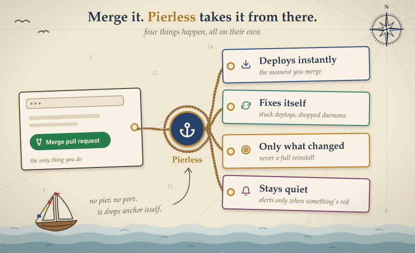
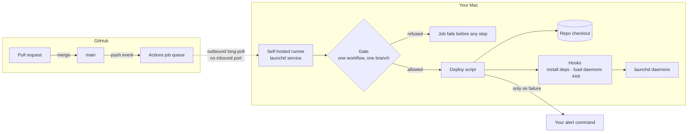
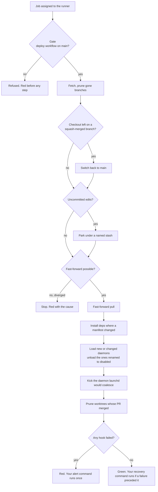

# pierless

Merge to main. Your Mac is running it seconds later. No open port, no tunnel, no secret to rotate.

<p align="center"></p>

       

pierless turns a GitHub self-hosted runner into a deploy-only agent for one Mac: the Mac that runs your agents, daemons, loops, and dashboards.

Two things stay true at once. Merged PRs land on the box by themselves. Edits you make by hand on the box are never overwritten and never block a deploy.

## What it adds

The runner and git move the bytes. pierless adds the rules:

- **One door.** The gate refuses every job except one workflow on one branch. Fails closed. No network calls.
- **Never force.** Diverged, fetch failed, cannot fast-forward: the run goes red and says why. No reset, ever.
- **Park, never overwrite.** Uncommitted edits on the box go into a named stash, only when a pull is actually happening. If the pull fails, they come straight back.
- **Self-heal.** A box stranded on a squash-merged branch is put back on main and deployed.
- **Install only what moved.** Dependencies reinstall only where a manifest changed.
- **Daemons ship with their code.** A new or changed launchd plist loads on the deploy that carries it. Rename it to `.disabled` and it unloads.
- **Kick what launchd drops.** Coalesced file events lose a restart; pierless kicks the daemon you name.
- **Prune finished worktrees.** Only when the PR merged, the tree is clean, and no session holds it.
- **Alert on failure only.** Your command runs once on a red deploy, your recovery command once on the next green. Silence otherwise.

## Use it

On the Mac, once:

```bash
git clone https://github.com/oficiallyAkshay/pierless ~/.pierless/src
~/.pierless/src/bin/pierless install --repo you/your-repo
```

Registers the runner, runs it under launchd, and installs the gate outside every checkout so no branch can edit it. The other verbs: `status`, `dry-run`, `uninstall`.

In your repo, `.github/workflows/deploy.yml` (every option in `examples/deploy.yml`):

```yaml
on:
  push: { branches: [main] }
  schedule: [{ cron: "17 * * * *" }]
concurrency: { group: deploy, cancel-in-progress: false }
jobs:
  deploy:
    runs-on: [self-hosted, macOS, pierless]
    steps:
      - uses: oficiallyAkshay/pierless@v0
        with:
          repo: /Users/you/your-checkout
```

Done.

## How it sits

Nothing on the Mac listens. The runner asks GitHub for work; the gate decides whether it may run.




## One deploy

Every branch off the happy path ends red with its cause.




## License

MIT
