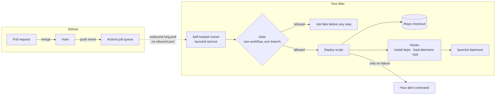
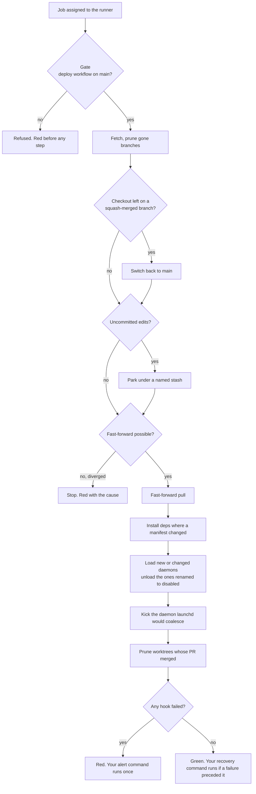

# Architecture

Two diagrams, moved here from the README: how a merge reaches the Mac, and what one deploy run does step by step. Both are reference material for CONTRIBUTING.md, not the README's shape.

## How it sits

Nothing on the Mac listens. The runner asks GitHub for work; the gate decides whether it may run.

## One deploy

Every branch off the happy path ends red with its cause.

